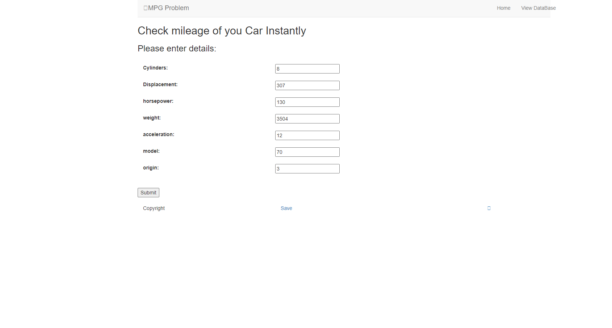
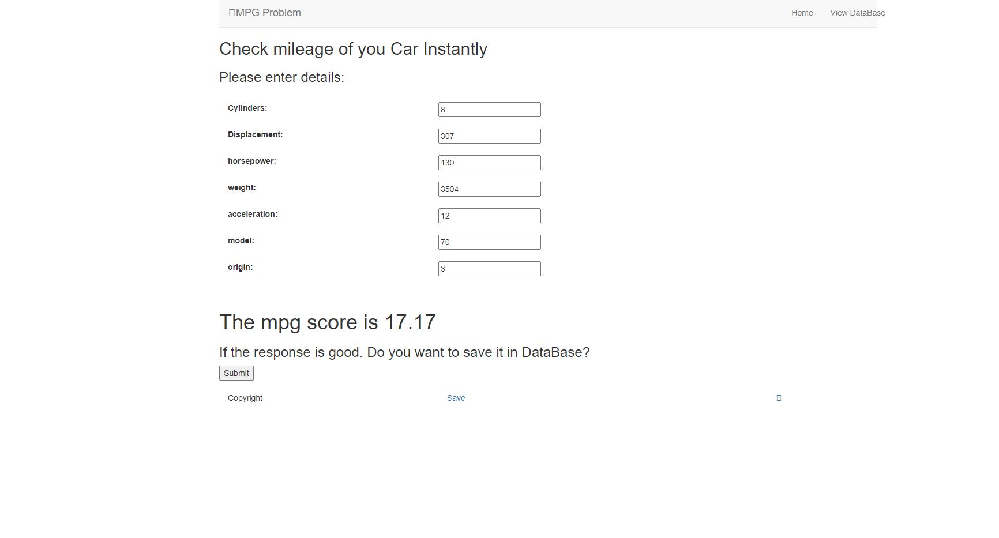
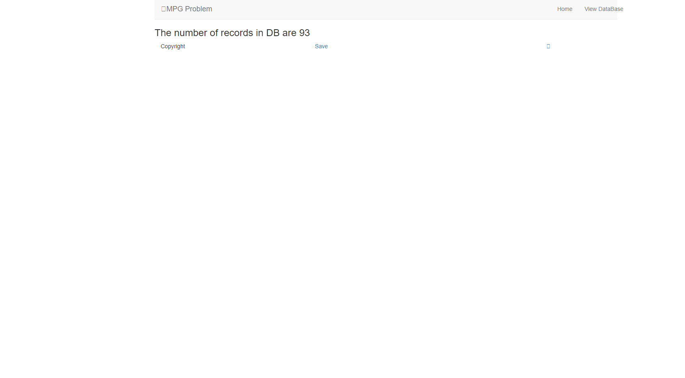

# mpg
## Mileage per gallon performances of various cars

The ultimate aim is to create a web application which can predict the mileage of the car based on the user inputs. 

Steps involved:

* *training the Random Forest Regressor model with auto-mpg dataset(available in kaggle) and make predictions with test data in Anaconda environment*
* *Setup Django in virtual environment and install the required packages/libraries*
* *Front-end development for user to give inputs to the model(form-based) and obtain predictions*
* *MongoDB connection with Django server*
* *Option to user to update the data in database*
* *Deploy the model for serving it in Django*

### Run Migrations

        python manage.py makemigrations
        python manage.py migrate

### Create super user
        python manage.py createsuperuser

### Run server
        python manage.py runserver

###  Serving static files 
        python manage.py collectstatic

### Homepage

### viewDatabase 

